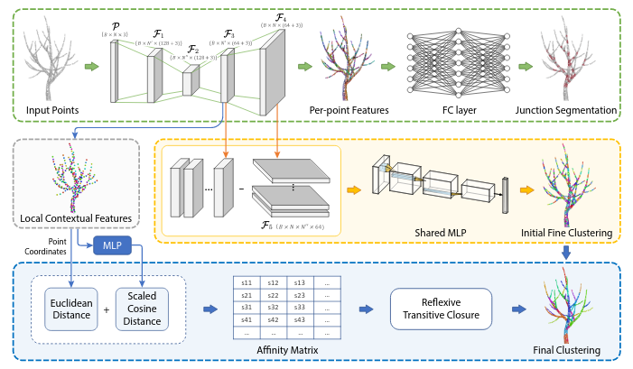
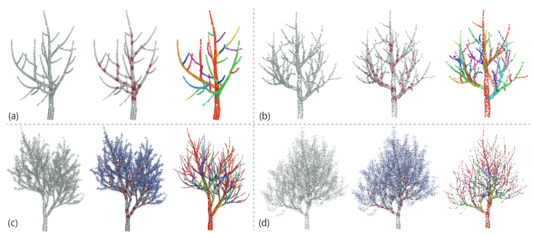

# TreePartNet

This is the code repository implementing the paper "TreePartNet: Neural Decomposition of Point Clouds for 3D Tree Reconstruction".




## Dependecy and Setup
The project is tested on Ubuntu 18.04 with cuda10.1. 

Requirements:
- python==3.7
- pytorch==1.5.0
- pytorch-lightning==0.8.5

The PointNet++ pytorch implementation is modified from [Pointnet2_Pytorch](https://github.com/erikwijmans/Pointnet2_PyTorch). Install dependencies:
```
pip install -r requirements.txt
```

## Data
The gravity direction in tree point cloud is down along y-axis! All tree point cloud are normalized. see the code in utils for more details. 




- Dataset for foliage segmentation: 16K points per tree, hdf5 format, [Download Link](https://mailsucaseducn-my.sharepoint.com/:f:/g/personal/liuyanchao18_mails_ucas_edu_cn/Eg3s4r5_7GZIneYgPeV7SNABLg6oVE7yJvgF38UJYKki6Q?e=zZiUlb)
- Dataset for neural decomposition: 8K points per tree, hdf5 format, [Download Link](https://1drv.ms/u/s!Am5H_4z5WHyYa7TmZLatW6ZHMaE?e=W4toEN)

## Training
After downloading the data and put them in data folder, the foliage segmentation network can be trained as
```
python train_foliage.py
```
and the TreePartNet can be trained using
```
python train.py
```
The hyperparameters can be modified in these 2 python files.

## Testing
The trained checkpoints can be found in dir *fckpt* and *ckpt*.
To predict foliage segmentation on test data set above:
```
python test_foliage.py
```
and neural decomposition:
```
python test.py
```

## Reference
If you find our work useful in your research, please cite us using the following BibTeX entry.
```
@article{TreePartNet21,
title={TreePartNet: Neural Decomposition of Point Clouds for 3D Tree Reconstruction},
author={Yanchao Liu and Jianwei Guo and Bedrich Benes and Oliver Deussen and Xiaopeng Zhang and Hui Huang},
journal={ACM Transactions on Graphics (Proceedings of SIGGRAPH ASIA)},
volume={40},
number={6},
pages={},
year={2021},
} 
```